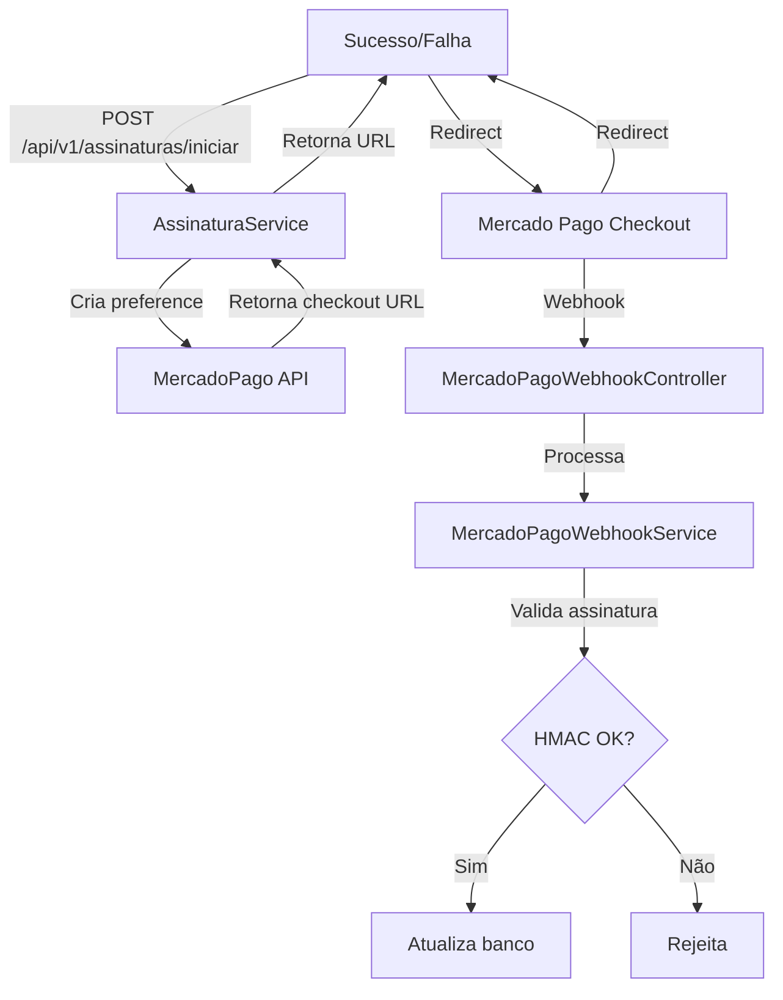

# Relatório de Análise de Segurança - Sistema OSMech

## Visão Geral

Este relatório apresenta a análise de segurança da arquitetura do sistema OSMech, com foco específico na integração com a API de pagamento do Mercado Pago e nos pontos vulneráveis que podem comprometer o sistema.

**Data da Análise:** 11/03/2026  
**Analista:** Arquitetura de Segurança  
**Escopo:** Backend API, Integração Mercado Pago, Autenticação e Autorização

---

## Sumário Executivo

O sistema OSMech apresenta várias vulnerabilidades de segurança, sendo a mais crítica a **exposição de credenciais sensíveis em arquivos de configuração versionados**. A integração com o Mercado Pago possui proteções razoáveis, mas apresenta lacunas que podem ser exploradas em ambientes de desenvolvimento.

### Nível de Risco Geral: **ALTO**

---

## Vulnerabilidades Críticas

### 1. Credenciais Expostas no Repositório (CRITICAL)

**Localização:** `backend/.env`

**Descrição:** O arquivo `.env` contém credenciais de produção reais que estão sendo versionadas no repositório Git:

```
MERCADOPAGO_ACCESS_TOKEN=APP_USR-74539269564142-022119-6e3ed4bc27cf456e3f2be19356aa86f6-302862907
MERCADOPAGO_PUBLIC_KEY=APP_USR-0f23666a-a06d-454c-8532-b0f2f1b94605
MERCADOPAGO_WEBHOOK_SECRET=27418cc029a73222c51f6527d264914273db8fff8715884f9759d8d01ec2a024
JWT_SECRET=Kd0E36SiW0M11xso2lq88z9qty3nuWSd2hsoObQAIqJzNVxepIEeZPU0nNy2weBozxIbAN7RvdvrNBu7I+NEyA==
DB_PASSWORD=3782
AI_OPENAI_API_KEY=0d55ddf7e7af424eb55b2f61fdbd1e7b.Z5DhTF3RMudJ60VBuLmGEED5
```

**Impacto:**
- Comprometimento completo da conta Mercado Pago
- Acesso não autorizado aos dados de pagamento
- Possível fraude financeira
- Exposição de dados de clientes

**Recomendação Imediata:**
1. Remover imediatamente estas credenciais do repositório
2. Revogar todas as chaves expostas no painel do Mercado Pago
3. Gerar novas credenciais
4. Adicionar `.env` ao `.gitignore` (verificar se já está)
5. Usar um cofre de segredos (HashiCorp Vault, AWS Secrets Manager) em produção

---

### 2. Validação de Webhook Desabilitada em Dev (CRITICAL)

**Localização:** [`MercadoPagoWebhookService.java`](backend/src/main/java/com/osmech/payment/service/MercadoPagoWebhookService.java:50-76)

**Descrição:** O sistema tem uma lógica de validação de assinatura HMAC-SHA256 para webhooks, mas ela é completamente **desabilitada em modo de desenvolvimento**:

```java
@PostConstruct
public void validateProductionConfig() {
    if (webhookSecret == null || webhookSecret.isBlank()) {
        log.warn("Webhook requests will be ACCEPTED WITHOUT SIGNATURE VALIDATION.");
        log.warn("This is acceptable for LOCAL DEVELOPMENT only.");
    }
    // ...
    if (isProd && (webhookSecret == null || webhookSecret.isBlank())) {
        throw new IllegalStateException(...);
    }
}
```

O problema é que a validação não é aplicada quando `webhookSecret` está vazio (dev):

```java
private void validarAssinaturaSeConfigurada(...) {
    String secret = trimToNull(webhookSecret);
    if (secret == null) {
        return;  // RETORNA SEM VALIDAR!
    }
    // ... validação só acontece se secret estiver configurado
}
```

**Impacto:**
- Ataque de replay de webhook
- Criação de pagamentos fraudulentos
- Ativação não autorizada de assinaturas
- Alteração de status de pagamentos

**Recomendação:**
1. Implementar validação de assinatura **obrigatória** em todos os ambientes
2. Adicionar verificação de IP de origem do Mercado Pago
3. Implementar timestamp validation para evitar replay attacks
4. Criar lista de IPs autorizados do Mercado Pago

---

## Vulnerabilidades de Alto Risco

### 3. Ausência de Rate Limiting (HIGH)

**Localização:** [`SecurityConfig.java`](backend/src/main/java/com/osmech/config/SecurityConfig.java)

**Descrição:** Os endpoints de autenticação não possuem limitação de taxa:

```java
.requestMatchers("/api/auth/**", "/api/planos/**", "/api/mercadopago/webhook").permitAll()
```

**Impacto:**
- Ataques de força bruta no login
- Enumeration de emails válidos
- Negação de serviço (DoS)

**Recomendação:**
- Implementar rate limiting (ex: Bucket4j, Resilience4j)
- Limitar tentativas de login
- Adicionar CAPTCHA após múltiplas tentativas

---

### 4. Possível IDOR em Listagem de Pagamentos (HIGH)

**Localização:** [`PagamentoController.java`](backend/src/main/java/com/osmech/payment/controller/PagamentoController.java:44-48)

**Descrição:** O endpoint GET `/api/pagamento` lista pagamentos, mas a query usa o email do token:

```java
public List<PagamentoResponse> listar(Authentication auth) {
    return pagamentoService.listar(auth.getName());
}
```

O serviço filtra corretamente pelo `usuarioId`:
```java
public List<PagamentoResponse> listar(String emailUsuario) {
    Usuario usuario = getUsuario(emailUsuario);
    return pagamentoRepository.findByUsuarioIdOrderByCriadoEmDesc(usuario.getId())
```

**Avaliação:** Esta implementação parece correta. No entanto, há risco potencial em outros endpoints.

---

### 5. Falta de Validação de Valor de Pagamento (HIGH)

**Localização:** [`AssinaturaService.java`](backend/src/main/java/com/osmech/payment/service/AssinaturaService.java:97-116)

**Descrição:** Ao criar um pagamento de assinatura, o valor é obtido do plano, mas não há validação cruzada:

```java
Pagamento pagamento = Pagamento.builder()
    .valor(plano.getPreco())  // Usa valor do plano
    // ...
```

Se um atacante conseguir manipular o `plano.getPreco()` ou a requisição, podría haver inconsistências.

**Recomendação:**
1. Validar que o valor do pagamento corresponde exatamente ao preço do plano
2. Nunca confiar apenas em dados do cliente
3. Adicionar validação server-side do valor

---

## Vulnerabilidades de Médio Risco

### 6. Webhook sem Verificação de IP de Origem (MEDIUM)

**Localização:** [`MercadoPagoWebhookController.java`](backend/src/main/java/com/osmech/payment/controller/MercadoPagoWebhookController.java)

**Descrição:** O endpoint `/api/mercadopago/webhook` aceita requisições de qualquer IP:

```java
@PostMapping("/webhook")
public ResponseEntity<Map<String, String>> receberPost(
        @RequestParam Map<String, String> queryParams,
        @RequestHeader Map<String, String> headers,
        @RequestBody(required = false) Map<String, Object> body) {
    // Não verifica IP de origem
}
```

**Recomendação:**
- Implementar whitelist de IPs do Mercado Pago
- O Mercado Pago usa ranges específicos para webhooks

---

### 7. Exposição de Informações em Mensagens de Erro (MEDIUM)

**Localização:** [`AuthService.java`](backend/src/main/java/com/osmech/auth/service/AuthService.java:33-35)

**Descrição:** Mensagens de erro podem revelar se um email está cadastrado:

```java
if (usuarioRepository.existsByEmail(request.getEmail())) {
    throw new IllegalArgumentException("Email já cadastrado");  // Confirma existência
}
```

```java
.orElseThrow(() -> new IllegalArgumentException("Credenciais inválidas"));
```

**Impacto:**
- Enumeração de emails válidos
- Facilita ataques de força bruta

**Recomendação:**
- Usar mensagens genéricas como "Email ou senha incorretos"

---

### 8. Sem Auditoria de Operações Sensíveis (MEDIUM)

**Descrição:** Não há logs de auditoria para:
- Alterações de status de assinatura
- Cancelamentos
- Modificações de pagamento
- Alterações de plano

**Recomendação:**
- Implementar sistema de audit log
- Registrar quem, quando, o que foi alterado

---

### 9. Ausência de HTTPS Forçado em Produção (MEDIUM)

**Localização:** [`SecurityConfig.java`](backend/src/main/java/com/osmech/config/SecurityConfig.java)

**Descrição:** O Spring Security não força HTTPS explicitamente:

```java
http.cors(cors -> cors.configurationSource(corsConfigurationSource()))
    .csrf(csrf -> csrf.disable())
```

**Recomendação:**
- Adicionar configuração para forçar HTTPS
- Habilitar HSTS (HTTP Strict Transport Security)

---

## Vulnerabilidades de Baixo Risco

### 10. Falta de Validação de Entrada em Alguns Campos (LOW)

**Localização:** [`PagamentoRequest.java`](backend/src/main/java/com/osmech/payment/dto/PagamentoRequest.java)

**Descrição:** Alguns campos não têm validação adequada:

```java
private String descricao;  // Sem @Size ou validação
private String observacoes; // Sem @Size ou validação
```

**Recomendação:**
- Adicionar validação de tamanho máximo
- Sanitizar entrada para prevenir XSS

---

### 11. Tokens JWT com Expiração Longa (LOW)

**Localização:** [`JwtUtil.java`](backend/src/main/java/com/osmech/security/JwtUtil.java)

**Descrição:** O token tem expiração configurável (padão 24 horas):

```java
@Value("${app.jwt.expiration-ms}") long expirationMs
// Default: 86400000ms = 24 horas
```

**Recomendação:**
- Considerar tokens de menor duração
- Implementar refresh tokens

---

## Análise da Integração com Mercado Pago

### Fluxo Atual de Pagamento



### Pontos Positivos da Integração

1. **Validação de Assinatura HMAC-SHA256** implementada
2. **Proteção contra duplicatas** com `MercadoPagoWebhookEvent`
3. **Mapeamento correto de status** do Mercado Pago para status interno
4. **Separação de concerns** entre controllers e services
5. **Transações adequadas** com `@Transactional`

### Pontos de Atenção

1. **Assinatura opcional em dev** - Vulnerabilidade crítica
2. **Sem idempotência garantida** - Possíveis race conditions
3. **Busca de pagamento por external_reference** - Pode falhar em alguns cenários

---

## Recomendações Prioritárias

### Ação Imediata (Próximas 24 horas)

| # | Ação | Prioridade |
|---|------|------------|
| 1 | Revogar credenciais expostas no Mercado Pago | CRITICAL |
| 2 | Alterar senha do banco de dados | CRITICAL |
| 3 | Revogar API keys expostas | CRITICAL |
| 4 | Remover .env do repositório | CRITICAL |
| 5 | Adicionar .env ao .gitignore | CRITICAL |

### Ação de Curto Prazo (Próxima Semana)

| # | Ação | Prioridade |
|---|------|------------|
| 6 | Implementar validação obrigatória de webhook | HIGH |
| 7 | Adicionar rate limiting nos endpoints | HIGH |
| 8 | Implementar whitelist de IPs para webhook | MEDIUM |
| 9 | Adicionar audit logging | MEDIUM |
| 10 | Forçar HTTPS em produção | MEDIUM |

### Ação de Médio Prazo (Próximo Mês)

| # | Ação | Prioridade |
|---|------|------------|
| 11 | Implementar sistema de audit trail | MEDIUM |
| 12 | Adicionar validação de valor de pagamento | MEDIUM |
| 13 | Considerar refresh tokens | LOW |
| 14 | Implementar testes de segurança automatizados | LOW |

---

## Conclusão

O sistema OSMech apresenta vulnerabilidades significativas, principalmente relacionadas à exposição de credenciais e validação de webhooks. A integração com o Mercado Pago possui uma arquitetura razoável, mas a segurança em ambiente de desenvolvimento está comprometendo a segurança geral do sistema.

A recomendação principal é **revogar imediatamente todas as credenciais expostas** e implementar a validação obrigatória de assinatura de webhooks em todos os ambientes.

---

*Este relatório deve ser revisado periodicamente e as vulnerabilidades devem ser monitoradas quanto ao seu status de correção.*
